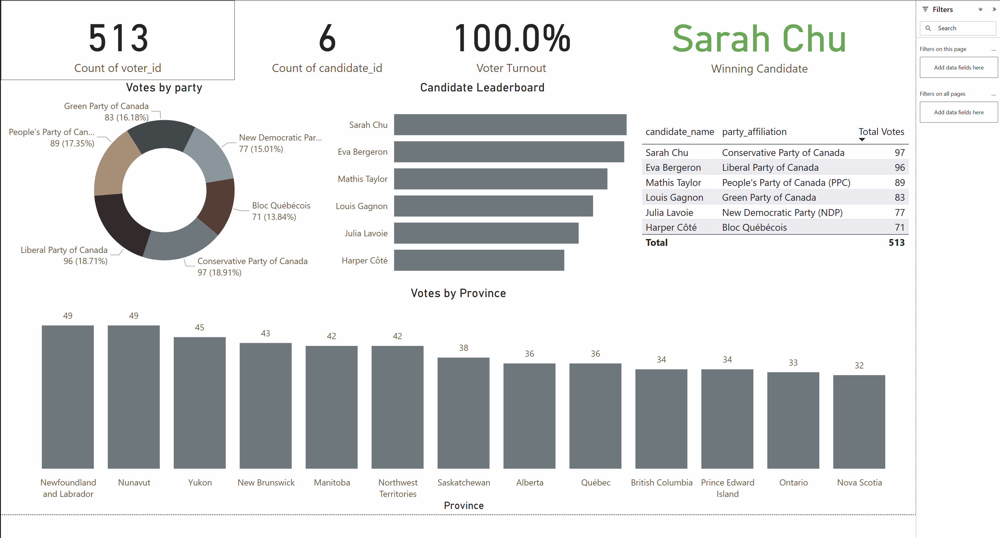

# End-to-End Election Voting System Data Pipeline

This project simulates a full-scale **real-time election voting system** using a modern data stack: Apache Kafka, Apache Spark Streaming, PostgreSQL, Google BigQuery, dbt, Airflow, and Power BI. The system ingests, streams, stores, models, and visualizes vote data, simulating the lifecycle from voter registration to final analytics.

---

## Table of Contents

1. [Project Overview](#project-overview)
2. [Architecture Diagram](#architecture-diagram)
3. [Tools and Technologies](#tools-and-technologies)
4. [System Components](#system-components)
5. [Setup Instructions](#setup-instructions)
6. [How to Run the Pipeline](#how-to-run-the-pipeline)
7. [Data Models (dbt)](#data-models-dbt)
8. [Power BI Visualizations](#power-bi-visualizations)
9. [Troubleshooting & Tips](#troubleshooting--tips)
10. [Acknowledgments](#acknowledgments)

---

## Project Overview

This pipeline emulates a national election scenario where:

* Voter and candidate data is generated and streamed in real time.
* Votes are randomly cast and processed through Kafka.
* Spark reads Kafka streams and writes to BigQuery.
* dbt performs data modeling on the raw vote data.
* Power BI visualizes voter turnout, candidate performance, and geographic trends.

The entire system is containerized using Docker Compose.

---

## Architecture Diagram

A simplified visual of the data flow:

1. `main.py` → Generates voter & candidate data → Kafka (`voter_registration` topic)
2. `voting_system.py` → Consumes `voter_registration` → Generates votes → Produces to `votes_topic`
3. `spark-streaming.py` → Reads from `votes_topic` → Streams to BigQuery
4. Airflow DAG (`dbt_refresh.py`) → Runs dbt models in BigQuery
5. Power BI → Connects to modeled tables for dashboarding

---

## Tools and Technologies

* **Python 3.10**
* **Apache Kafka** (via Docker)
* **Apache Spark 3.5.5**
* **PostgreSQL (v16 via Docker)**
* **Google BigQuery** (via Service Account Key)
* **dbt (v1.7, BigQuery adapter)**
* **Apache Airflow (2.9.1)**
* **Docker Compose**
* **Power BI Desktop**

---

## System Components

### 1. Main Application Scripts

* `main.py`: Generates and inserts voter/candidate data into PostgreSQL and Kafka.
* `voting_system.py`: Simulates voting by consuming from Kafka and producing enriched vote events.

### 2. Kafka Topics

* `voter_registration`: carries raw voter data.
* `votes_topic`: carries enriched vote events.

### 3. Spark Streaming

* Reads from `votes_topic`.
* Streams vote data to BigQuery (`raw_data.raw_vote_events`).

### 4. dbt Models

* Transforms raw BigQuery data into analytics-ready dimensional models (e.g., `dim_candidate`, `fact_vote`).

### 5. Airflow DAG

* Schedules and runs dbt tasks on a 5-minute interval.

### 6. Power BI

* Connects to BigQuery.
* Visualizes KPIs, vote shares, province stats, and winner insights.

---

## Setup Instructions

### Prerequisites

* Python 3.10+
* Docker & Docker Compose
* Power BI Desktop
* GCP Service Account Key (JSON)

### 1. Clone Repository

```bash
https://github.com/yourusername/Election-Voting-System-Pipeline.git
cd End-to-End-Data-Pipeline-for-Election-Voting-system-kafka-spark-postgresSQL-viz
```

### 2. Install Dependencies

```bash
python -m venv .venv
.venv\Scripts\activate       # Windows
pip install -r requirements.txt
```

### 3. Export GCP Credentials

```powershell
$env:GOOGLE_APPLICATION_CREDENTIALS="C:\path\to\data-stream-pipeline-xxxx.json"
```

### 4. Build Docker Image

```bash
docker build -f Dockerfile.airflow-dbt -t airflow-dbt:latest .
```

### 5. Start Services

```bash
docker-compose up -d --build airflow-webserver airflow-scheduler
```

---

## How to Run the Pipeline

1. **Activate environment**

```bash
.venv\Scripts\activate
```

2. **Generate Voter and Candidate Data**

```bash
python main.py
```

3. **Simulate Voting Process**

```bash
python voting_system.py
```

4. **Start Spark Streaming to BigQuery**

```bash
python spark-streaming.py
```

5. **Visit Airflow Dashboard**

* Navigate to: `http://localhost:8082`
* Unpause `dbt_refresh` DAG
* DAG runs every 5 minutes

---

## Data Models (dbt)

### Raw Source

* `raw_data.raw_vote_events`\* (auto-ingested from Kafka via Spark)\*

### dbt Models

* `dim_voter`
* `dim_candidate`
* `dim_party`
* `dim_location`
* `dim_date`
* `fact_vote`

All models are **incremental** and use proper `unique_key` logic to prevent duplication.

---

## Power BI Visualizations

* Connect to BigQuery `election_schema`.
* Use tables: `fact_vote`, `dim_candidate`, `dim_location`, etc.
* Manual refresh is required in Power BI Desktop unless Power BI Pro or Premium is used for scheduled refresh.

### Key Visuals
* Voter Turnout %
* Votes by Candidate
* Party Distribution
* Votes by Province
* KPI cards (Total Votes, Candidates, Winner)

🖼 Report Screenshots

🔸 Report Page 1: Overview Dashboard

---

## Troubleshooting & Tips

* ❗ **Kafka not consuming?** Make sure ports `9092` are not blocked and `broker` is healthy.
* ❗ **Spark job not running?** Verify dependencies and correct JAR file in config.
* ❗ **BigQuery errors?** Confirm your service account key is valid and BigQuery project permissions are set.
* 🧠 **Tip**: Use `spark.sparkContext.setLogLevel("WARN")` to reduce console noise.


